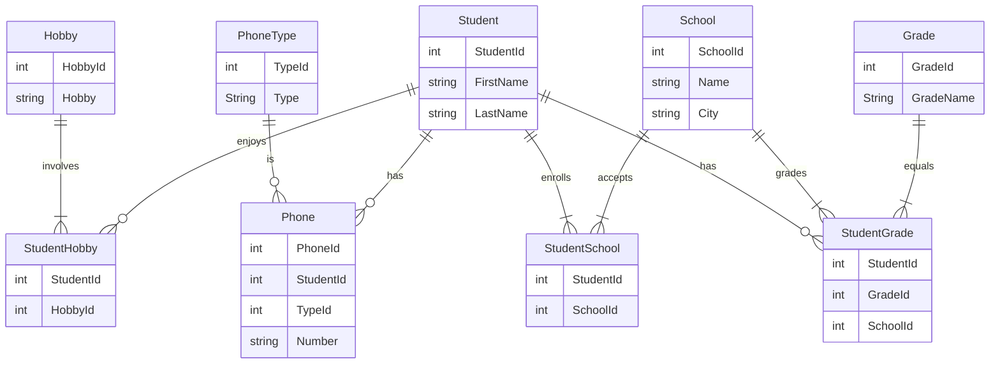
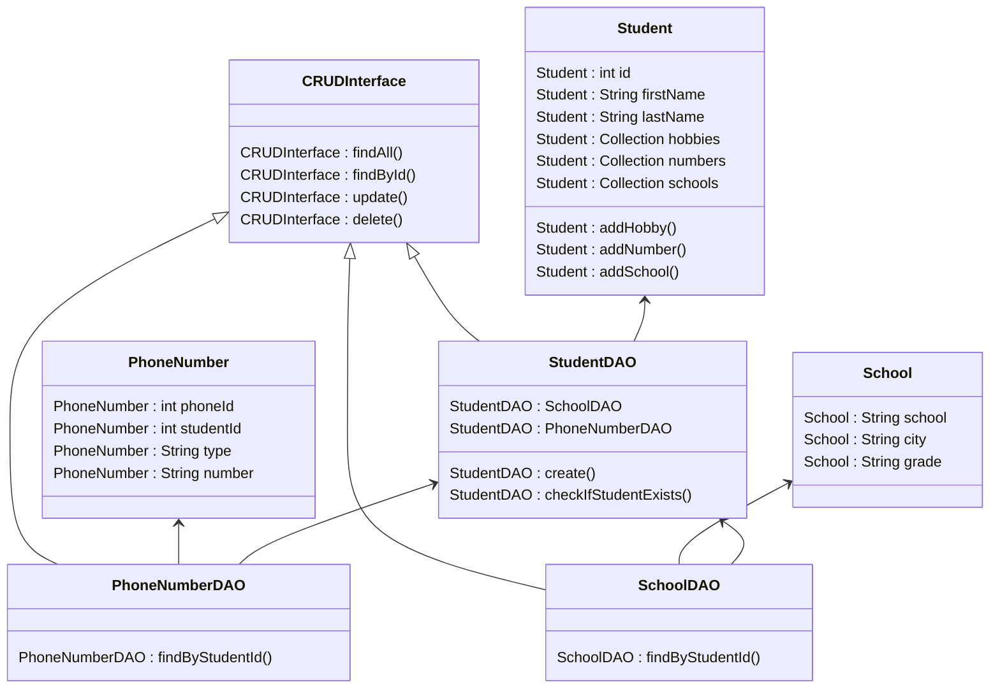

# Slutuppgift Databaser

### av Ellinor Ekmark

## Beskrivning

Uppgiften gick ut på att använda en mysql databas i docker, och normalisera data med hjälp av ett script i databasen, samt skapa en javaapplikation som kan kommunicera med databasen. Javaapplikationen ska ha ORM (Object Relational Mapping) och kunna skapa objekt från databasen, samt ha grundläggande CRUD (Create, Read, Update, Delete) funktion. Som en bonus gjorde jag ett försök att implementera ett DAO pattern.

## Gör detta först

Skapa en docker med en mysql databas. Användarnamn iths och lösenord iths. 
i mysql måste du se till att iths har rätt behörigheter med 
Grant file on *.* for 'iths'@'%';

filen denormalized-data.csv måste ligga i docker maskinen på /var/lib/mysql-files/denormalized-data.csv

sedan kan normaliseringen köras genom att skriva i bash

docker exec -i iths-mysql mysql -uiths -piths < normalisering.sql

Nu borde databasen ha normaliserats.
Detta behöver göras innan vi kör javaapplikationen.

###Att köra javaapplikationen
skriv i bash: gradle run

observera att det finns vissa metoder i applikationen som inte demonstreras fullt ut genom att endast köra programmet. 

## E-R Diagram

## UML class diagram
please note I have not included the standard setters and getters.

## Normalisering

docker exec -i iths-mysql mysql -uiths -piths < normalisering.sql
