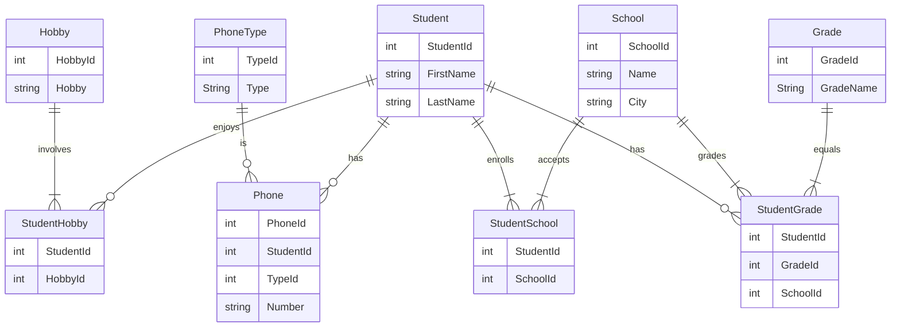

# Slutuppgift Databaser

### av Ellinor Ekmark


## E-R Diagram



## UML class diagram
please note I have not included the standard setters and getters.

```mermaid
classDiagram

CRUDInterface <|-- StudentDAO
CRUDInterface <|-- SchoolDAO
CRUDInterface <|-- PhoneNumberDAO
Student <-- StudentDAO
School <-- SchoolDAO
PhoneNumber <-- PhoneNumberDAO


CRUDInterface {
CRUDInterface : findAll()
CRUDInterface : findById()
CRUDInterface : update()
CRUDInterface : delete()
}


```


## Normalisering

docker exec -i iths-mysql mysql -uiths -piths < normalisering.sql
