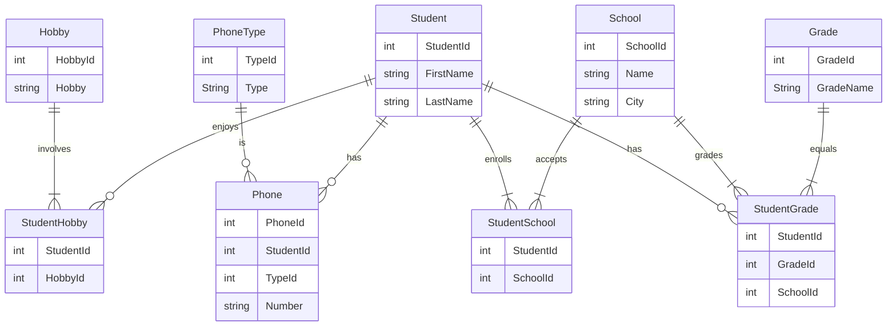
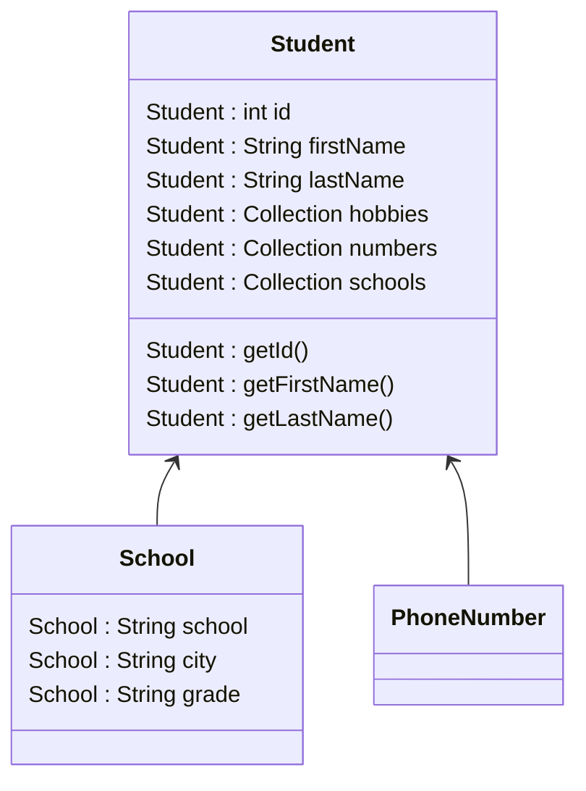

# Slutuppgift Databaser

### av Ellinor Ekmark

## E-R Diagram

```mermaid

erDiagram    
    Hobby ||--|{ StudentHobby : involves
    PhoneType ||--o{ Phone : is
    Student ||--o{StudentHobby : enjoys
    Student || --|{StudentSchool : enrolls
    Student || -- o{Phone : has
    School ||--|{ StudentSchool : accepts
    Student ||--o{ StudentGrade : has
    School ||--|{ StudentGrade : grades
    Grade ||--|{ StudentGrade : equals
    
    
    StudentSchool {
        int StudentId
        int SchoolId
    }
    
    Student {
        int StudentId
        string FirstName
        string LastName
    }
    
    School {
        int SchoolId
        string Name
        string City
    }

    StudentHobby {
        int StudentId
        int HobbyId
    }

    Hobby {
        int HobbyId
        string Hobby
    }

    Phone {
        int PhoneId
        int StudentId
	int TypeId
        string Number
    }

    PhoneType {
	int TypeId
	String Type
    }

    Grade {
	int GradeId
	String GradeName
    }

    StudentGrade {
	int StudentId
	int GradeId
	int SchoolId
    }

```

```mermaid
classDiagram
Student <-- School
Student <-- PhoneNumber

class Student {
Student : int id
Student : String firstName
Student : String lastName
Student : Collection<String> hobbies
Student : Collection<PhoneNumber> numbers
Student : Collection<School> schools
Student : getId()
Student : getFirstName()
Student : getLastName()
}

class School {
School : String school
School : String city
School : String grade
}


```

## Normalisering

docker exec -i iths-mysql mysql -uiths -piths < normalisering.sql
