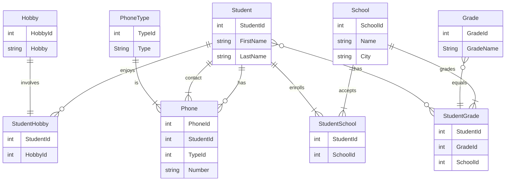

## E-R Diagram

```mermaid

erDiagram    
    Hobby ||--||StudentHobby : involves
    Student ||--o{StudentHobby : enjoys
    PhoneType ||--|{ Phone : is
    Student ||--|{Phone : contact
    Student || --|{StudentSchool : enrolls
    Student || -- o{Phone : has
    School ||--|{ StudentSchool : accepts
    Student }o--o{ StudentGrade : has
    Grade }o--|| StudentGrade : equals
    School ||--|{ StudentGrade : grades
    
    
    StudentSchool {
        int StudentId
        int SchoolId
    }
    
    Student {
        int StudentId
        string FirstName
        string LastName
    }
    
    School {
        int SchoolId
        string Name
        string City
    }

    StudentHobby {
        int StudentId
        int HobbyId
    }

    Hobby {
        int HobbyId
        string Hobby
    }

    Phone {
        int PhoneId
        int StudentId
	int TypeId
        string Number
    }

    PhoneType {
	int TypeId
	String Type
    }

    Grade {
	int GradeId
	String GradeName
    }

    StudentGrade {
	int StudentId
	int GradeId
	int SchoolId
    }

```
