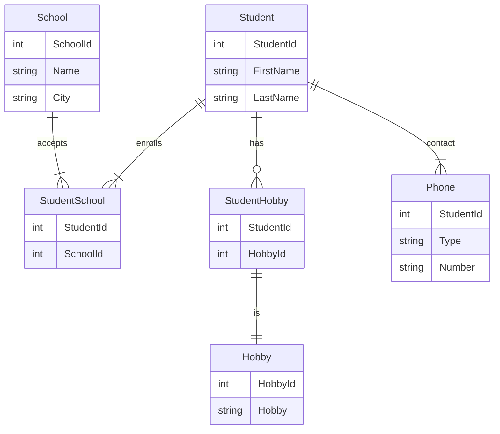

```mermaid

erDiagram    
    School ||--|{ StudentSchool : accepts
    Student || --|{StudentSchool : enrolls
    Student ||--o{StudentHobby : has
    StudentHobby ||--||Hobby : is
    Student ||--|{Phone : contact
    
    
    StudentSchool {
        int StudentId
        int SchoolId
    }
    
    Student {
        int StudentId
        string FirstName
        string LastName
    }
    
    School {
        int SchoolId
        string Name
        string City
    }

    StudentHobby {
        int StudentId
        int HobbyId
    }

    Hobby {
        int HobbyId
        string Hobby
    }

    Phone {
        int StudentId
        string Type
        string Number
    }

```
